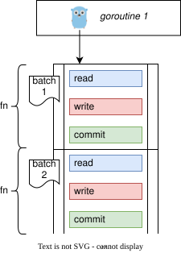
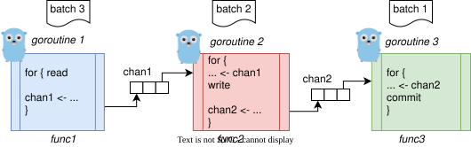
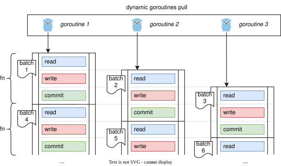

[](https://pkg.go.dev/github.com/cardinalby/go-conveyor)
[](https://github.com/cardinalby/go-conveyor/actions/workflows/test.yml)
[](https://github.com/cardinalby/go-conveyor/actions/workflows/list.yml)

The lib proposes a new way of building pipelines in Go orthogonal to classical goroutines + channels approach.
You code the path of your data item through the steps instead of coding loops that execute the same steps for all items.

It's optimized and well suited for batch processing of messages from brokers (Kafka, RabbitMQ, etc.) but
can be used for any **pull-based** processing.

```bash
go get github.com/cardinalby/go-conveyor
```

# Concept

## Basic example

Suppose we have a typical 3-step pipeline that:
- **read** stage: consumes messages from Kafka / RabbitMQ and collects them in a batch
- **write** stage: writes some data from the batch to a database
- **commit** stage: acknowledges the message / commits offsets on the broker

## 1. A gopher who doesn't know about pipelines would

Spin 1 goroutine with `fn` in loop that executes steps one by one:

```go
// (1) read messages
// (2) write to DB                    (nobody reads messages now - underutilized)
// (3) commit offsets / ack messages  (nobody writes to DB now - underutilized)
```



- `fn` is responsible for processing 1 batch of messages (1 "item")
- Easy to read and write, but:
  - ⚠️ While one of the steps is busy, the other steps are idle and resources are underutilized.

## 2. A good gopher would:
- spin **3** goroutines with **3 functions**, each:
    - is responsible for **one stage**
    - loops over the input
- connect goroutines with channels between stages
- don't forget to provide the proper shutdown logic:
    - wait for all goroutines to finish
    - close the channels in the right order

The picture shows the saturated pipeline:
- batch1 reached "commit" stage
- batch2 reached "write" stage
- batch3 entered "read" stage


 
## 3. A "conveyor" user would:

- create Conveyor, define stages (steps)
- modify `fn` (from 1st example) by adding `stage.MoveTo` calls between stages
- delegate the dispatching, goroutines and shutdown management to the conveyor using this 
  single "ItemProcessor" `fn`

```go
c := conveyor.NewConveyor()
// "read" stage is implicitly created with items limit = 1
writeStage := c.AddStage()
commitStage := c.AddStage()

itemProcessor := func(ctx context.Context) error {
    // itemProcessor is started only once "read" stage is available 
    
    // (1) read messages:
    // batch := ...
    
    // Atomic:
    // - wait and enter "write" stage (once available) 
    // - exit "read" stage making it available for the next batch
    if err := writeStage.MoveTo(ctx); err != nil {
        // happens on ctx cancellation or conveyor shutdown
        return err 
    }
    
    // (2) write to DB or return an error
    // for item := range batch { ... }
    
    // - enter "commit", 
    // - release "write" stage
    if err := commitStage.MoveTo(ctx); err != nil {
        return err
    }
    
    // (3) commit offsets / ack messages or return an error:
    // broker.Ack(batch)
    
    return nil
    // Conveyor can reuse the goroutine for the next processor call
}

// - starts 1st itemProcessor immediately
// - starts new processors once "read" stage is released
shutdownErr := c.Run(ctx, itemProcessor)
```



**Stages** are smart **locks** with ordered admission:
- `MoveTo` is atomic: it waits for the stage to be available and releases the previous stage providing backpressure
- Deadlock-free: you can move only forward to the next stage, not backward

You still have a **single function** that processes a single batch, but the Conveyor takes care of:
- dispatching new items (batches) to the next available goroutine from the dynamic pool
- graceful shutdown of the pipeline
- observability, dynamic concurrency limits and queue sizes for stages, etc.

## Pros

1. Code the path of a single batch ("item") through the stages:
   - easier to write / read / debug / trace / reason about
   - less wiring (no channels, no goroutines, no loops in user code)
   - easy to upgrade from existing "1-goroutine" version (just add `MoveTo` calls)
2. If _**"stage1"**_ produces some data for _**"stage3"**_, use it directly at _**"stage3"**_:
   - you don't need to pass it through _**"stage2"**_ like you would do in channels
   - you are inside a single function for a single item/batch and keep the batch processing state
3. You can **skip** some stages with natural control flow (if/else, return):
   - with channels, you would need to send a "skip" signal through the channels
   - with channels, it's complicated to send data from "stage1" to "stage3" if "stage2" is a fan-out stage 
4. Supports deadlock-free [scatter-gather](https://pkg.go.dev/github.com/cardinalby/go-conveyor#Conveyor.AddFanOut) 
   stages
5. Dynamic concurrency limits and queue sizes for stages (gracefully adjusted in runtime)
6. Goroutines pool is dynamically adjusted (goroutines are reused for new items)
7. Graceful **shutdown** happens naturally, just respect the context:
   - If item N fails:
     - the conveyor stops spawning new items
     - items with number > N receive a context cancellation error and can't enter any stage
     - all items that are already in the pipeline are allowed to finish
   - If the context passed to `c.Run()` is canceled:
     - all items that are already in the pipeline are allowed to finish
     - new items are not spawned
   - [Force shutdown support](https://pkg.go.dev/github.com/cardinalby/go-conveyor#OptShutdownContext)
8. Pull-based [observability](https://pkg.go.dev/github.com/cardinalby/go-conveyor#Conveyor.Stats)

## Cons
- New paradigm and API to learn
- **Not all topologies** (possible with channels) can be expressed (windowing, feedback loops, splits without join, etc.)
- Worse performance compared to channels for CPU-bound scenarios
  - The lib is optimized for IO-bound scenarios (especially if each item is a batch of messages)
  - [Any significant difference](docs/8_benchmarks.md) is only observable if your stages take less than
    **100 microseconds** to process an item / batch.

# Features

See the [docs](docs/README.md) for guides on these features:

- [Retain previous stage longer](docs/1_retain-previous-stage.md)
- [Queues](docs/2_queues.md)
- [Shared Stages](docs/3_shared-stages.md)
- [Fan-out (scatter/gather)](docs/4_fan-out.md)
- [Lanes: when a branch is a pipeline](docs/5_lanes.md)
- [Conditional MoveTo](docs/6_conditional-move-to.md)
- [Observability](docs/7_observability.md)

## [★ Interactive demo](https://cardinalby.github.io/go-conveyor/)

- Build different conveyor topologies
- Simulate them in browser (against lib's WebAssembly build)