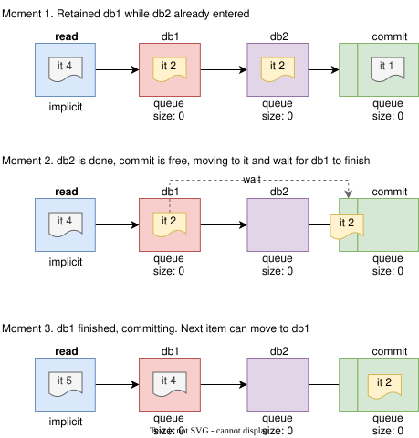

# Retain previous stage longer

Sometimes you don't want to release the previous stage immediately after entering the next one — you want to
finish some work in the previous stage first, without letting the next item enter it:

```go
c := conveyor.NewConveyor()
db1 := c.AddStage()
db2 := c.AddStage()
commit := c.AddStage()

c.Run(ctx, func(ctx context.Context) error {
    // (1) read batch
    
    if err := db1.MoveTo(ctx); err != nil {
        return err
    }
    // (2) work with db1 exclusively, perform some reads and prepare data for db2
    
    // get db1 retention handle
    db1wave := db1.Retain(ctx, func () error {
        // finalize the job by writing to db1 still holding the "db1" stage. 
        // capture and use ItemProcessor's ctx so that you don't miss shutdown signal
        // Any error returned by the callback is propagated to the itemProcessor and stops the conveyor
        return nil
    })
    
    // acquire db2 but don't release db1 (Retain is still holding it)
    if err := db2.MoveTo(ctx); err != nil {
        return err
    }
    // (3) write to db2
    
    // Release "db2" and enter "commit"
    if err := commit.MoveTo(ctx); err != nil {
        return err
    }
    // Wait for the db1.Retain callback to finish, holding the "commit" slot meanwhile. Put the Wait before
    // commit.MoveTo to hold the "db2" slot instead. An error returned by the callback is returned here as
    // "db1 work: <err>" and stops the conveyor.
    if err := db1wave.Wait(ctx); err != nil {
        return err
    }

    // (4) commit offsets / ack messages
    return nil
})
```



`Wave.Wait` may be called only by the item that created the wave. A wave nobody waits for is not lost: an error on it
fails the item when it completes. If the callback fails while other work of the item is still winding down, `Wait`
returns the item's cancellation cause instead; wait for `Finished` and read `Err`, or call `Wait` again after
`Finished` is closed, to observe the wave's own error.

---

| Prev                  | Next                     |
|-----------------------|--------------------------|
| [⬅ Index](README.md) | [Queues ➡](2_queues.md) |
