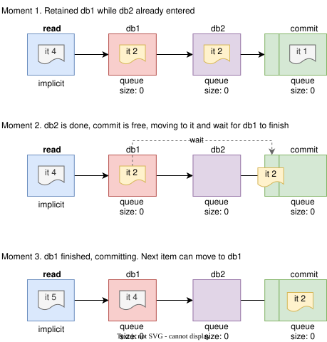

# Retain previous stage longer

Sometimes you don't want to release the previous stage immediately after entering the next one. There are two ways
to keep it:

- `Retain(ctx)` keeps the stage until you call the returned `release`. Use it when later work of the item (in the
  ItemProcessor or in its fan-out tasks) still uses the stage's resource.
- `RetainFor(ctx, fn)` keeps the stage while `fn` runs in the background, in parallel with the next stages. Wait for
  it later with `Wave.Wait`.

## Retain: keep the stage until release

`stage1` and `pool1` work with the same resource, so no next item may enter `stage1` while the item's `pool1` task
runs:

```go
c := conveyor.NewConveyor()
stage1 := c.AddStage()
fanOut := c.AddFanOut()
pool1 := fanOut.AddPool()
pool2 := fanOut.AddPool()

c.Run(ctx, func(ctx context.Context) error {
    if err := stage1.MoveTo(ctx); err != nil {
        return err
    }
    // (1) work with the resource exclusively

    release := stage1.Retain(ctx)
    // prepare the work before entering: it starts as soon as the item enters the fan-out
    if err := fanOut.Schedule(ctx,
        pool1.NewTask(func(ctx context.Context) error {
            defer release() // the next item may enter stage1 after this task
            // (2) work with the resource again
            return nil
        }),
        pool2.NewTask(func(ctx context.Context) error {
            // (3) unrelated work, runs in parallel
            return nil
        }),
    ); err != nil {
        return err
    }
    // stage1 is not released here
    return fanOut.MoveTo(ctx)
})
```

- The stage is freed when `release` is called **and** the item has moved on. A `release` called while the item is
  still in the stage changes nothing: the next `MoveTo` frees the stage as usual.
- `release` may be called from any goroutine, more than once.
- Each `Retain` call needs its own `release`: call it twice and give one to each task to keep the stage until both
  are done.
- A hold not released ends when the item completes, after all its tasks have finished. So `release` from a task is
  safe, but a goroutine you start yourself may still run after the stage was freed. Use `RetainFor` for such work.
- `Retain` holds the stage on a canceled item too: such an item cannot move on, and the hold ends when it completes.

## RetainFor: finish the stage's work in the background

Here the item finishes some work in the previous stage while it already works in the next one, and no next item
enters the previous stage meanwhile:

```go
c := conveyor.NewConveyor()
db1 := c.AddStage()
db2 := c.AddStage()
commit := c.AddStage()

c.Run(ctx, func(ctx context.Context) error {
    // (1) read batch
    
    if err := db1.MoveTo(ctx); err != nil {
        return err
    }
    // (2) work with db1 exclusively, perform some reads and prepare data for db2
    
    // get db1 retention handle
    db1wave := db1.RetainFor(ctx, func () error {
        // finalize the job by writing to db1 still holding the "db1" stage. 
        // capture and use ItemProcessor's ctx so that you don't miss shutdown signal
        // Any error returned by the callback is propagated to the itemProcessor and stops the conveyor
        return nil
    })
    
    // acquire db2 but don't release db1 (RetainFor is still holding it)
    if err := db2.MoveTo(ctx); err != nil {
        return err
    }
    // (3) write to db2
    
    // Release "db2" and enter "commit"
    if err := commit.MoveTo(ctx); err != nil {
        return err
    }
    // Wait for the db1.RetainFor callback to finish, holding the "commit" slot meanwhile. Put the Wait before
    // commit.MoveTo to hold the "db2" slot instead. An error returned by the callback is returned here as
    // "db1 work: <err>" and stops the conveyor.
    if err := db1wave.Wait(ctx); err != nil {
        return err
    }

    // (4) commit offsets / ack messages
    return nil
})
```



`Wave.Wait` may be called only by the item that created the wave. A wave nobody waits for is not lost: an error on it
fails the item when it completes. If the callback fails while other work of the item is still winding down, `Wait`
returns the item's cancellation cause instead; wait for `Finished` and read `Err`, or call `Wait` again after
`Finished` is closed, to observe the wave's own error.

## Retain the starting stage

To retain the implicit starting stage of the conveyor, use its own `conv.StartingStage().Retain()` or
`RetainFor()` method. The next item is not created until the hold is released or the work returns.

For FanOut's Lane call `lane.Retain()` or `lane.RetainFor()` directly.

Both `Retain` and `RetainFor` may be called only while the item is in the stage. They panic after the item has moved
on, even if an earlier call still keeps the stage occupied.

---

| Prev                  | Next                     |
|-----------------------|--------------------------|
| [⬅ Index](README.md) | [Queues ➡](2_queues.md) |
