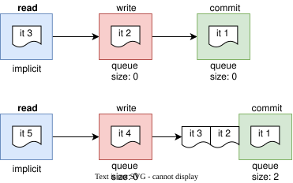

# Queues

By default, similar to channels, stages have no waiting room: if an item cannot enter a stage it waits until 
the stage is available. To change it:

```go
c := conveyor.NewConveyor()
write := c.AddStage()                   // no waiting room
commit := c.AddStage().SetQueueSize(2)  // waiting room of 2 items
```

### [★ Interactive Demo](https://cardinalby.github.io/go-conveyor/#%7B%22v%22%3A2%2C%22startDelayMs%22%3A1000%2C%22nodes%22%3A%5B%7B%22kind%22%3A%22stage%22%2C%22name%22%3A%22write%22%2C%22limit%22%3A1%2C%22queueSize%22%3A0%2C%22delayMs%22%3A1000%7D%2C%7B%22kind%22%3A%22stage%22%2C%22name%22%3A%22commit%22%2C%22limit%22%3A1%2C%22queueSize%22%3A2%2C%22delayMs%22%3A2150%7D%5D%2C%22mode%22%3A%22run%22%2C%22showCode%22%3Atrue%2C%22showLegend%22%3Afalse%7D)


If **commit** is occupied, but has free queue slots, calling `commit.MoveTo()` will:
- _**enqueue**_ the item in the waiting room (once it's the item's turn: the waiting room is FIFO in item order)
- _**release**_ the previous **write** stage so that the next item can enter it
- _**block**_ the item until it enters **commit** stage

If **commit** is free, the item enters it directly and never touches the waiting room, so a queue costs nothing
while the stage keeps up with its input.

`SetQueueSize` can be called at any time, from any goroutine, including on a running conveyor. 
It can grow a waiting room or shrink it or take it away entirely (`SetQueueSize(0)`). 
Every change is admission-only — growing the room admits waiting items at once,
shrinking never evicts the items already in it.

---

| Prev                                                          | Next                                   |
|---------------------------------------------------------------|----------------------------------------|
| [⬅ Retain previous stage longer](1_retain-previous-stage.md) | [Shared Stages ➡](3_shared-stages.md) |