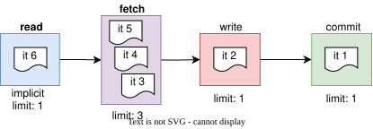

# Shared Stages

By default, **only 1 item** can enter a stage at a time: it's essential for stages that perform 
operations that should be serialized (writes, commit).

For read stages we may want to allow multiple items to enter the stage at a time.

```go
c := conveyor.NewConveyor()
fetchMetadata := c.AddStage().SetLimit(3) // 3 items can enter this stage at a time
write := c.AddStage()                     // only 1 item can enter this stage at a time
commit := c.AddStage()                    // only 1 item can enter this stage at a time

itemProcessor := func(ctx context.Context) error {
    // (1) read batch
    
    if err := fetchMetadata.MoveTo(ctx); err != nil {
        return err
    }
    // (2) fetch some metadata needed for item processing
    // 3 items can enter this block at a time, in no particular order
    
    // only 1 item can enter this block at a time. Enter is ordered: N+1, N+2 ... items
    // wait until Nth item enters and exits "write" stage
    if err := write.MoveTo(ctx); err != nil {
        return err
    }
    // (3) write to DB
    
    if err := commit.MoveTo(ctx); err != nil {
        return err
    }
    // (4) commit offsets / ack messages
    
    return nil
}    
```

### [★ Interactive Demo](https://cardinalby.github.io/go-conveyor/#%7B%22v%22%3A2%2C%22startDelayMs%22%3A1000%2C%22nodes%22%3A%5B%7B%22kind%22%3A%22stage%22%2C%22name%22%3A%22fetchMetadata%22%2C%22limit%22%3A3%2C%22queueSize%22%3A0%2C%22delayMs%22%3A2950%7D%2C%7B%22kind%22%3A%22stage%22%2C%22name%22%3A%22write%22%2C%22limit%22%3A1%2C%22queueSize%22%3A0%2C%22delayMs%22%3A1000%7D%2C%7B%22kind%22%3A%22stage%22%2C%22name%22%3A%22commit%22%2C%22limit%22%3A1%2C%22queueSize%22%3A0%2C%22delayMs%22%3A1000%7D%5D%2C%22mode%22%3A%22run%22%2C%22showCode%22%3Afalse%2C%22showLegend%22%3Afalse%7D)


Even if later (4, 5) items complete their work in **fetch** stage 
faster than "item 3", order of entering to **write** is still guaranteed: 3, 4, 5, ...

See also [Fan-out (scatter/gather)](4_fan-out.md) for running parallel branches of work within a shared stage,
and [Conditional MoveTo](6_conditional-move-to.md) for entering a stage only if it's immediately free.

---

| Prev                     | Next                                        |
|--------------------------|---------------------------------------------|
| [⬅ Queues](2_queues.md) | [Fan-out (scatter/gather) ➡](4_fan-out.md) |
