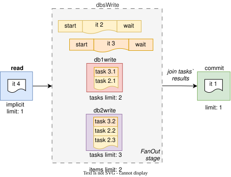

# Fan-out (scatter/gather)

_True fan-out without a join is not supported since we always describe the path of 1 item._

Imagine a **dbsWrite** stage where we want to perform parallel tasks (writing to 2 different DBs):
- Some items may need to write to both DBs
- Some may need to write to only 1
- DB pools may have different sizes and the backpressure should be propagated

Add a [FanOut](https://pkg.go.dev/github.com/cardinalby/go-conveyor#Conveyor.AddFanOut) stage for that case:

```go
c := conveyor.NewConveyor()
// SetLimit(2): 2 items can be inside the fan-out (have work outstanding on its branches) at a time
dbsWrite := c.AddFanOut().SetLimit(2)
// Pools are single-step branches with their own capacity limits (similar to connection pools)
db1Write := dbsWrite.AddPool().SetLimit(2) // 2 tasks (from 1 or more items) can occupy it at a time
db2Write := dbsWrite.AddPool().SetLimit(3) // 3 tasks (from 1 or more items) can occupy it at a time
commit := c.AddStage()

c.Run(ctx, func(ctx context.Context) error {
    // (1) read batch
    
    // Prepare tasks for dbsWrite stage
    var writeTasks conveyor.Tasks
    // A single task for db1Write
    writeTasks.Add(db1Write.NewTask(func(ctx context.Context) error {
        // write to db1
        return nil
    }))
    // 2 tasks for db2Write
    writeTasks.Add(db2Write.NewTasks(2, func(ctx context.Context, i int) error {
        // the function will be called 2 times, each with a different i (0 and 1)
        // write to db2
        return nil
    }))
    
    // (2) enter dbsWrite and schedule the tasks:
    // - releases the previous stage once the item enters dbsWrite (or its queue if it has one)
    // - enqueues tasks 
    // - order is guaranteed: tasks from earlier items are always executed before tasks from later items 
    //   on the same branch
    // - returns once tasks are scheduled (not finished), so the code below runs alongside them
    // - the item keeps its dbsWrite slot until it moves on, and it can't move on before all its
    //   tasks have finished: the tasks are this stage's body
    err := dbsWrite.MoveTo(ctx, writeTasks)
    if err != nil {
        return err
    }
    
    // - Wait until it can enter commit stage
    // - Wait until all tasks are finished and return an error if any of them failed
    if err := commit.MoveTo(ctx); err != nil {
        return err
    }

    // (3) commit offsets / ack messages    
    return nil
})
```
### [★ Interactive Demo](https://cardinalby.github.io/go-conveyor/#%7B%22v%22%3A2%2C%22startDelayMs%22%3A1000%2C%22nodes%22%3A%5B%7B%22kind%22%3A%22fanout%22%2C%22name%22%3A%22dbsWrite%22%2C%22limit%22%3A2%2C%22queueSize%22%3A0%2C%22branches%22%3A%5B%7B%22kind%22%3A%22pool%22%2C%22name%22%3A%22db1Write%22%2C%22limit%22%3A1%2C%22delayMs%22%3A1700%2C%22tasksPerItem%22%3A1%7D%2C%7B%22kind%22%3A%22pool%22%2C%22name%22%3A%22db2Write%22%2C%22limit%22%3A2%2C%22delayMs%22%3A3150%2C%22tasksPerItem%22%3A1%7D%5D%7D%2C%7B%22kind%22%3A%22stage%22%2C%22name%22%3A%22commit%22%2C%22limit%22%3A1%2C%22queueSize%22%3A0%2C%22delayMs%22%3A1000%7D%5D%2C%22mode%22%3A%22run%22%2C%22showCode%22%3Afalse%2C%22showLegend%22%3Afalse%7D)


It's similar to using a `sync.WaitGroup` inside the dbsWrite stage, but gives you:
- granular **backpressure** control (all pools are fully utilized)
- **ordering** guarantees: earlier tasks always have priority over later ones (in taking slots on the branches)
- Tasks are claimed before `MoveTo` making **deadlocks impossible**

If:
- **db1Write** is fast and has free slots, but 
- **db2Write** is slow and saturated
- AND **dbsWrite** has a free slot (limit > 1)

Then:
- The next item can also move to **dbsWrite** by adding tasks to the **db1Write** pool, while 
the slow **db2Write** pool is still processing tasks from the previous item.
- Even if the next item completes its tasks first, it cannot move to **commit** stage before the previous item does

Use [Tasks](https://pkg.go.dev/github.com/cardinalby/go-conveyor#Tasks),
[Pool.NewTask](https://pkg.go.dev/github.com/cardinalby/go-conveyor#Pool.NewTask),
[Pool.NewTasks](https://pkg.go.dev/github.com/cardinalby/go-conveyor#Pool.NewTasks),
[Pool.NewTasksGen](https://pkg.go.dev/github.com/cardinalby/go-conveyor#Pool.NewTasksGen),
[Pool.NewTasksChan](https://pkg.go.dev/github.com/cardinalby/go-conveyor#Pool.NewTasksChan)
to create tasks for a branch (a [Lane](https://pkg.go.dev/github.com/cardinalby/go-conveyor#Lane) has the
same four constructors).


A fan-out fans out to **branches**, and there are two kinds of them:

| branch   | built with         | what it is                                      | capacity                    |
|----------|--------------------|-------------------------------------------------|-----------------------------|
| **pool** | `FanOut.AddPool()` | one step: a task runs there and is done         | `SetLimit(n)` — n at a time |
| **lane** | `FanOut.AddLane()` | a sub-pipeline: the task travels its own stages | its stages' own limits      |

Most fan-outs need only pools. Lanes are for the case where one branch's work is itself a multi-step
path — see [Lanes](5_lanes.md). Start with pools; you'll know when you need a lane.

Both kinds satisfy [Branch](https://pkg.go.dev/github.com/cardinalby/go-conveyor#Branch) — the four task
constructors they share — so code that only builds work on a branch needn't care which kind it got.
`FanOut.Branches()` returns them all, in creation order.

## FanOut.Detach()

If you don't need to wait for the results of FanOut's tasks at the next stage's `MoveTo()` call, you can detach
the wave and wait for the tasks to finish later
(similar to [Retain](https://pkg.go.dev/github.com/cardinalby/go-conveyor#Stage.Retain)):

```go
// ... previous code ...

err := dbsWrite.MoveTo(ctx, writeTasks)
if err != nil {
    return err
}

wave := dbsWrite.Detach(ctx) // detach the wave and let the tasks finish in background

// - DON'T wait for the tasks to finish (Detach was called)
if err := anotherStage.MoveTo(ctx); err != nil {
    return err
}

// work in another stage

// - Wait for the wave's tasks to finish and return an error if any of them failed
if err := commit.MoveTo(ctx, wave); err != nil {
    return err
}

// commit
```

Detaching moves the wait, not the ceiling: the **dbsWrite** slot is still held until the tasks finish (it follows the
work instead of the item), so `SetLimit` keeps bounding how many items have work outstanding. And an error on a wave
that nobody ever joins is not lost — it fails the item when it completes.

---

| Prev                                   | Next                       |
|----------------------------------------|-----------------------------|
| [⬅ Shared Stages](3_shared-stages.md) | [Lanes ➡](5_lanes.md) |
