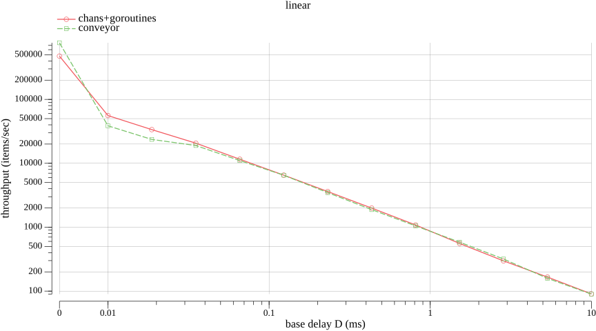
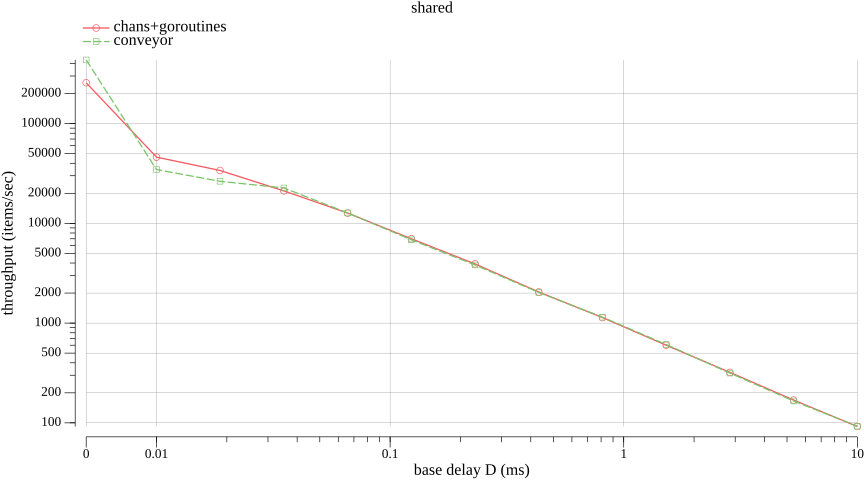
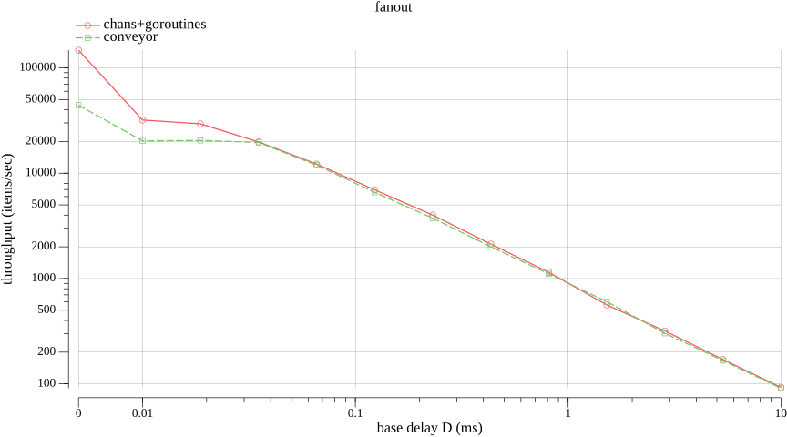

Conveyor was benchmarked against a classical pipeline implementation for
3 different topologies with different "base delay". 

- "Base delay" is sleep duration inside a step
- In fan-out and shared topologies some nodes multiply the base delay to saturate the pipeline

Graphs show throughput (items/sec) for different base delays.

### 6 stages with limit = 1

### 5 stages with limit = 1 + one stage with limit = 16 

### 5 stages with limit = 1 + fanout with 2 branches (each with limit = 16)

---

| Prev                                   |
|----------------------------------------|
| [⬅ Observability](7_observability.md) |